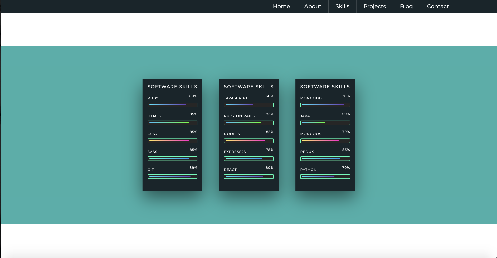

# T1A3 Portfolio Website

## Submitted by: Wilson Esmundo

For the link to the published portfolio website 
Please click [here](https://charliegucci.github.io/wilson_esmundo_portfolio/) 
 
For the link to the Github repository 
Please click [here](https://github.com/charliegucci/wilson_esmundo_portfolio) 
 

### Description of Portfolio website

#### Purpose

- It's a professional way to organize your accomplishments,
  goals, aspirations, and personal
  thought. It also gives us the opportunity to showcases your
  personality, skills and talent to potential
  employers and organizations. 

#### Functionality / Features

- Clear and concise 
- Creative 
- Ease of contact 
- Visibility 

#### Site Map

 

#### Screenshots

- HomePage 
   
   
- About Page 
   
   
- Skills Page 
   
   
- Projects Page 
   
   
  Blog Page 
   
   
  Contact Page 
   
   

#### Target Audience

- I wanted to create a portfolio that showcased my works, skills and talent while being able to keep a clean, well-designed website. The target audience for my portfolio website would be people who are in need of a web designer, other designers, or employers who may be looking for a web designer and can code at the same time. 
   

#### Tech Stack

- Html5 
- Css3 
- Sass 
- Javascript 
- GitHub
